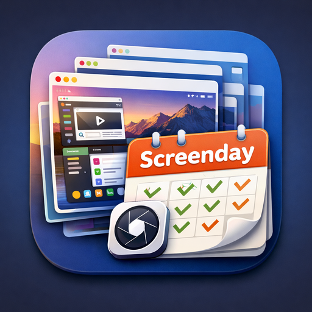

<p align="center">
  
</p>

# ScreenDay

A minimalist macOS menu bar app that captures periodic screenshots to a folder.

## Why I Built This

I wanted a simple application to capture my activity at work all day and send summaries of daily activity to my Obsidian repo.

I started with the [Dayflow](https://github.com/JerryZLiu/Dayflow) app, which is very nice but was not compatible with Obsidian, so I decided to build a minimalist screen capture app that just populates a folder with screenshots. I then use custom scripts to analyze the screenshots and drop activity summaries into my Obsidian vault.

## Features

- **Menu Bar Only** — No dock icon, just a clean menu bar presence
- **Configurable Intervals** — 5 seconds to 5 minutes
- **Smart Storage Management** — Auto-prunes oldest screenshots when approaching limits
- **System-Aware** — Pauses during sleep and screen lock

## Requirements

- macOS 14.0+
- Screen Recording permission

## Installation

Download the latest release from [Releases](../../releases), unzip, and move to `/Applications`.

**Or build from source:**

```bash
./install-and-run.sh
```

After launching, grant Screen Recording permission in System Settings > Privacy & Security > Screen Recording.

## Usage

1. Click the camera icon in the menu bar
2. Open Settings to configure destination folder, interval, and storage limit
3. Toggle "Capture Screenshots" ON

## Debugging

View live logs:

```bash
./view-logs.sh
```

## License

MIT
